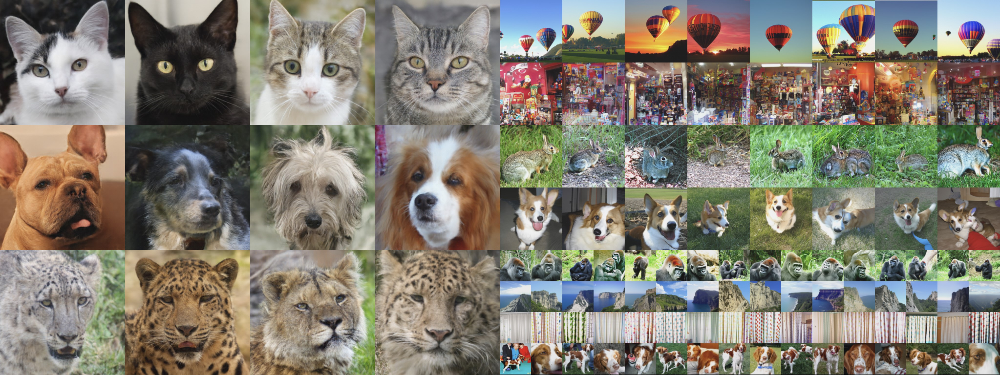

# Normalizing Flows are Capable Generative Models

This repo contains code that accompanies the research paper, [Normalizing Flows are Capable Generative Models](http://arxiv.org/abs/2412.06329).

 

# Setup

```bash
pip install -r requirements.txt
```

# Preparing datasets

Download the datasets you want to experiment with:
- [Imagenet](https://www.image-net.org/download.php)
- [Imagenet64](https://arxiv.org/abs/1601.06759)
- [AFHQ](https://www.kaggle.com/datasets/dimensi0n/afhq-512)

Save the training files only in `data/<dataset>/<category>/<filename>`, the code does not use the validation/test files.

Compute and save stats for the true data distribution
```bash
# Files are saved in ./data
torchrun --standalone --nproc_per_node=8 prepare_fid_stats.py --dataset=imagenet64 --img_size=64  # Unconditional
torchrun --standalone --nproc_per_node=8 prepare_fid_stats.py --dataset=imagenet --img_size=64    # Conditional
torchrun --standalone --nproc_per_node=8 prepare_fid_stats.py --dataset=imagenet --img_size=128   # Conditional
torchrun --standalone --nproc_per_node=8 prepare_fid_stats.py --dataset=afhq --img_size=256       # Conditional
```

Note: To run on a single GPU, replace `torchrun` with `python` like this:
```bash
python prepare_fid_stats.py --dataset=imagenet --img_size=64    # Conditional
```

# Training

Reproducing results from the paper
```bash
# Unconditional ImageNet64 (8 GPUs)
torchrun --standalone --nproc_per_node=8 train.py --dataset=imagenet64 --img_size=64 --channel_size=3\
  --patch_size=2 --channels=768 --blocks=8 --layers_per_block=8\
  --noise_std=0.05 --batch_size=256 --epochs=200 --lr=1e-4 --nvp\
  --sample_freq=5 --logdir=runs/imagenet64-uncond

# Conditional ImageNet64 (8 GPUs)
torchrun --standalone --nproc_per_node=8 train.py --dataset=imagenet --img_size=64 --channel_size=3\
  --patch_size=2 --channels=768 --blocks=8 --layers_per_block=8\
  --noise_std=0.05 --batch_size=256 --epochs=200 --lr=1e-4 --nvp --cfg=0 --drop_label=0.1\
  --sample_freq=5 --logdir=runs/imagenet64-cond

# Conditional ImageNet128 (need to run on 4 nodes, 32 GPUs total)
torchrun --standalone --nproc_per_node=8 train.py --dataset=imagenet --img_size=128 --channel_size=3\
  --patch_size=4 --channels=1024 --blocks=8 --layers_per_block=8\
  --noise_std=0.15 --batch_size=768 --epochs=320 --lr=1e-4 --nvp --cfg=0 --drop_label=0.1\
  --sample_freq=20 --logdir=runs/imagenet128-cond

# AFHQ (8 GPUs)
torchrun --standalone --nproc_per_node=8 train.py --dataset=afhq --img_size=256 --channel_size=3\
  --patch_size=8 --channels=768 --blocks=8 --layers_per_block=8\
  --noise_std=0.07 --batch_size=256 --epochs=4000 --lr=1e-4 --nvp --cfg=0 --drop_label=0.1\
  --sample_freq=200 --logdir=runs/afhq256
```


For single-GPU
```bash
python train.py --dataset=imagenet64 --img_size=64 --channel_size=3\
  --patch_size=2 --channels=768 --blocks=8 --layers_per_block=8\
  --noise_std=0.05 --batch_size=32 --epochs=200 --lr=1e-4 --nvp\
  --sample_freq=5 --logdir=runs/imagenet64-uncond
# etc...
```

# Sampling
Use the notebook to generate samples from a model checkpoint. Inside the notebook is an option to [download a pretrained checkpoint](https://ml-site.cdn-apple.com/models/tarflow/afhq256/afhq_model_8_768_8_8_0.07.pth) on AFHQ. 
```
jupyter notebook sample.ipynb
```

# Evaluating FID

Multi-GPU (8 GPUs)
```bash
# Conditional ImageNet64, samples saved in runs/imagenet64-cond/eval
torchrun --standalone --nproc_per_node=8 evaluate_fid.py --dataset=imagenet --img_size=64 --channel_size=3\
  --patch_size=2 --channels=768 --blocks=8 --layers_per_block=8\
  --noise_std=0.05 --cfg=2.3 --nvp --batch_size=1024\
  --ckpt_file=runs/imagenet64-cond/imagenet_model_2_768_8_8_0.05.pth\
  --logdir=runs/imagenet64-cond/eval
```

For single-GPU
```bash
# Conditional ImageNet64, samples saved in runs/imagenet64-cond/eval
python evaluate_fid.py --dataset=imagenet --img_size=64 --channel_size=3\
  --patch_size=2 --channels=768 --blocks=8 --layers_per_block=8\
  --noise_std=0.05 --cfg=2.3 --nvp --batch_size=32\
  --ckpt_file=runs/imagenet64-cond/imagenet_model_2_768_8_8_0.05.pth\
  --logdir=runs/imagenet64-cond/eval
```

# BibTeX
```bibtex
@article{zhai2024tarflow,
         title={Normalizing Flows are Capable Generative Models},
         author={Shuangfei Zhai and Ruixiang Zhang and Preetum Nakkiran and David Berthelot and Jiatao Gu and Huangjie Zheng and Tianrong Chen and Miguel Angel Bautista and Navdeep Jaitly and Josh Susskind},
         year={2024},
         eprint={2412.06329},
         archivePrefix={arXiv},
         primaryClass={cs.CV},
         url={https://arxiv.org/abs/2412.06329}
}
```